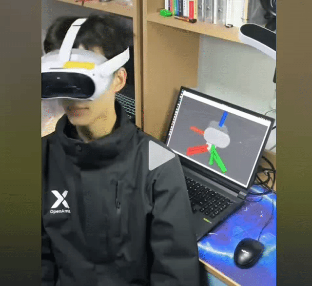

# openarmx_head_teleop_vr_pico

English | [中文](./README-CN.md)

---




Teleoperation node for the OpenArmX head using Pico VR headset orientation tracking.

## Overview

This Python package provides a ROS 2 node that maps Pico VR headset orientation to OpenArmX head joint commands. It implements relative control (activated by button toggle), smooth step-limiting, soft joint limits, startup homing, and emergency stop support.

## Features

- **Relative orientation control**: Press the right controller B button to toggle head tracking. The reference quaternion is captured at toggle-on, and relative rotation maps to head yaw/pitch.
- **Step-limited motion**: Maximum angular step per control cycle is limited for smooth movement (configurable slow/fast modes via rate input).
- **Soft joint limits**: Smooth easing near joint boundaries to avoid hard stops (configurable margin and blend width).
- **Startup homing**: Automatically moves the head back to zero position on startup before accepting VR input.
- **Emergency stop**: Subscribes to `/vr_estop_active` to suspend head control.
- **Optional TF visualization**: Publishes a debug TF frame for the commanded head target.

## Build

```bash
cd ~/openflex_ws
colcon build --packages-select openarmx_head_teleop_vr_pico
source install/setup.bash
```

## Launch

```bash
ros2 launch openarmx_head_teleop_vr_pico head_teleop_vr_pico.launch.py
```

### Launch Arguments / Parameters

| Parameter | Default | Description |
|-----------|---------|-------------|
| `control_rate` | `50.0` | Control loop frequency (Hz) |
| `button_b_topic` | `/pico_right_controller/button_b` | Topic for B button toggle (std_msgs/Bool) |
| `head_pose_topic` | `/pico_head/pose` | VR headset pose topic (geometry_msgs/PoseStamped) |
| `rate_topic` | `/pico_left_controller/rate` | Speed mode value (std_msgs/Float32, 0-1) |
| `command_topic` | `/head_forward_position_controller/commands` | Output command topic |
| `slow_max_step_deg` | `2.0` | Max step per cycle in slow mode (degrees) |
| `fast_max_step_deg` | `5.0` | Max step per cycle in fast mode (degrees) |
| `yaw_scale` | `1.0` | Yaw motion scale factor |
| `pitch_scale` | `1.0` | Pitch motion scale factor |
| `invert_yaw` | `false` | Invert yaw direction |
| `invert_pitch` | `false` | Invert pitch direction |
| `enable_soft_limits` | `true` | Enable soft joint limit blending |
| `yaw_soft_margin_deg` | `10.0` | Yaw soft limit margin from physical limit (degrees) |
| `pitch_soft_margin_deg` | `5.0` | Pitch soft limit margin (degrees) |
| `soft_limit_blend_deg` | `10.0` | Soft limit blend region width (degrees) |
| `startup_home_enabled` | `true` | Enable startup homing to zero |
| `startup_home_step_deg` | `1.0` | Homing step size per cycle (degrees) |
| `startup_home_tolerance_deg` | `1.0` | Homing completion tolerance (degrees) |
| `head_pose_timeout_sec` | `0.3` | Hold the current position after a VR head pose timeout (seconds) |
| `publish_visualization_tf` | `false` | Publish debug TF frame |

## Subscribed Topics

| Topic | Type | Description |
|-------|------|-------------|
| `/pico_head/pose` | `geometry_msgs/PoseStamped` | VR headset orientation |
| `/pico_right_controller/button_b` | `std_msgs/Bool` | B button for toggle on/off |
| `/pico_left_controller/rate` | `std_msgs/Float32` | Speed mode (0.0=slow, 1.0=fast) |
| `/joint_states` | `sensor_msgs/JointState` | Current head joint positions |
| `/vr_estop_active` | `std_msgs/Bool` | Emergency stop (transient local QoS) |

## Published Topics

| Topic | Type | Description |
|-------|------|-------------|
| `/head_forward_position_controller/commands` | `std_msgs/Float64MultiArray` | Position commands [yaw, pitch] in radians |

## TF (optional)

When `publish_visualization_tf` is `true`:
- Frame `head_teleop_target` (child of `head_base_link`): Represents the current commanded orientation.

## Control Flow

1. On startup, if `startup_home_enabled`, the node moves the head to zero position step-by-step.
2. Once homing completes, the node waits for the B button press.
3. On B button rising edge: toggle control on/off.
   - Toggle ON: captures current VR quaternion as reference, current joint positions as anchor.
   - Toggle OFF: holds current position.
4. While enabled: relative VR rotation is mapped to yaw/pitch commands with scaling, step limiting, and soft limits applied.

## Dependencies

- `rclpy`
- `geometry_msgs`, `sensor_msgs`, `std_msgs`
- `tf2_ros`

## Prerequisites

- `openarmx_head_bringup` must be running (provides the controller and joint states).
- The Pico VR headset streaming node must be publishing pose data.

## License

This work is licensed under the Creative Commons Attribution-NonCommercial-ShareAlike 4.0 International License (CC BY-NC-SA 4.0).

Copyright (c) 2026 Chengdu Changshu Robot Co., Ltd. (成都长数机器人有限公司)

For more details, see the [LICENSE](LICENSE) file or visit: http://creativecommons.org/licenses/by-nc-sa/4.0/

## Acknowledgments

This package is part of the OpenArmX robotic platform ecosystem, developed for research and industrial applications in collaborative robotics.

---

## 📞 Contact Us

### Chengdu Changshu Robot Co., Ltd.

| Contact           | Information                                                                                                  |
| ----------------- | ------------------------------------------------------------------------------------------------------------ |
| 📧 Email          | [openarmrobot@gmail.com](mailto:openarmrobot@gmail.com)                                                      |
| 📱 Phone / WeChat | +86-17746530375                                                                                              |
| 🌐 Website        | [https://openarmx.com/](https://openarmx.com/)                                                               |
| 🌐 Documentation  | [http://docs.openarmx.com/](http://docs.openarmx.com/)                                                               |
| 📍 Address        | Huacheng Machinery Plant, No.11 Xinye 8th Street, West Area, Tianjin Economic-Technological Development Area |
| 👤 Contact Person | Mr. Wang                                                                                                     |
